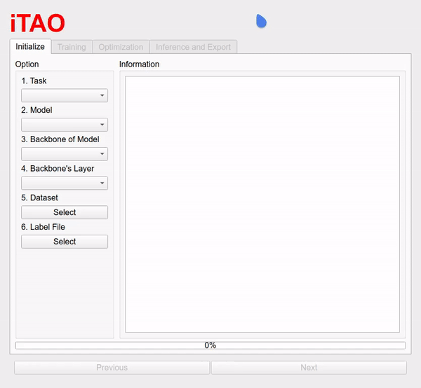
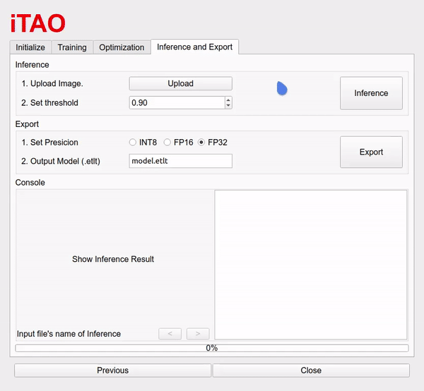

# itao-demo
`iTAO` is the GUI version for NVIDIA TAO Toolkit, and `itao-demo` is just for demonstration, any action is stimulated. 

## Pre-requisite
```
pip3 install numpy PyQt5 matplotlib pyqtgraph
```

## How to run?
```bash
python3 app.py
```

## Initialize


## Train model


## Optimization


## Inference & Export

