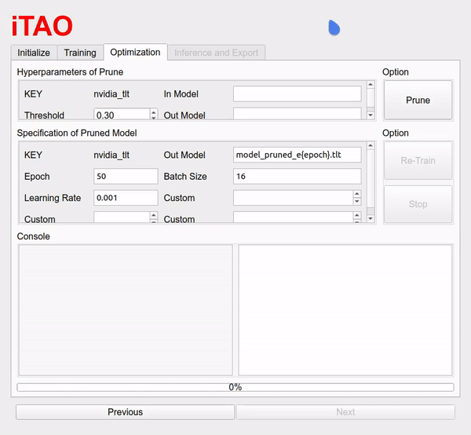

# itao-demo
`iTAO` is the GUI version for NVIDIA TAO Toolkit, and `itao-demo` is just for demonstration, any action is stimulated. 

## Pre-requisite
```
pip3 install numpy PyQt5 matplotlib pyqtgraph
```

## How to run?
```bash
python3 app.py
```

## Initialize
* Select all options.


## Train model
* Press "Train" to train model.


## Optimization
1. Press "Prune" to get the pruned model, and compare size with the unpruned model.
2. Press "Re-Train" to train the pruned model.


## Inference & Export
1. Press "Upload Data" to upload data and press "Inference".
2. Select "precision" and press "Export" to export the .etlt model.

